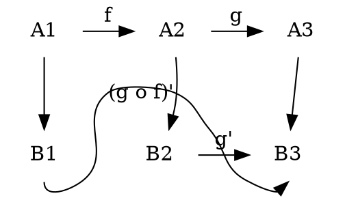
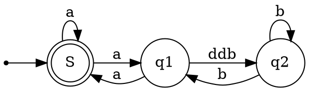
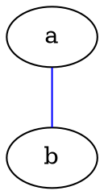

# DOT图


```dot
digraph g {
	node [shape=plaintext]
	A1 -> B1
	A2 -> B2
	A3 -> B3

    A1 -> A2 [label=f]
	A2 -> A3 [label=g]
	B2 -> B3 [label="g'"]
	B1 -> B3 [label="(g o f)'" tailport=s headport=s]

    { rank=same; A1 A2 A3 }
	{ rank=same; B1 B2 B3 }
}
```

````md

```dot
digraph g {
	node [shape=plaintext]
	A1 -> B1
	A2 -> B2
	A3 -> B3

    A1 -> A2 [label=f]
	A2 -> A3 [label=g]
	B2 -> B3 [label="g'"]
	B1 -> B3 [label="(g o f)'" tailport=s headport=s]

    { rank=same; A1 A2 A3 }
	{ rank=same; B1 B2 B3 }
}
```
````

# graphviz 图


```graphviz
digraph g {
	node [shape=plaintext]
	A1 -> B1
	A2 -> B2
	A3 -> B3

    A1 -> A2 [label=f]
	A2 -> A3 [label=g]
	B2 -> B3 [label="g'"]
	B1 -> B3 [label="(g o f)'" tailport=s headport=s]

    { rank=same; A1 A2 A3 }
	{ rank=same; B1 B2 B3 }
}
```

````md

```graphviz
digraph g {
	node [shape=plaintext]
	A1 -> B1
	A2 -> B2
	A3 -> B3

    A1 -> A2 [label=f]
	A2 -> A3 [label=g]
	B2 -> B3 [label="g'"]
	B1 -> B3 [label="(g o f)'" tailport=s headport=s]

    { rank=same; A1 A2 A3 }
	{ rank=same; B1 B2 B3 }
}
```
````


```graphviz
digraph finite_state_machine {
    rankdir=LR;
    size="8,5"
    node [shape = doublecircle]; S;
    node [shape = point ]; qi

    node [shape = circle];
    qi -> S;
    S  -> q1 [ label = "a" ];
    S  -> S  [ label = "a" ];
    q1 -> S  [ label = "a" ];
    q1 -> q2 [ label = "ddb" ];
    q2 -> q1 [ label = "b" ];
    q2 -> q2 [ label = "b" ];
}
```

````md

```graphviz
digraph finite_state_machine {
    rankdir=LR;
    size="8,5"
    node [shape = doublecircle]; S;
    node [shape = point ]; qi

    node [shape = circle];
    qi -> S;
    S  -> q1 [ label = "a" ];
    S  -> S  [ label = "a" ];
    q1 -> S  [ label = "a" ];
    q1 -> q2 [ label = "ddb" ];
    q2 -> q1 [ label = "b" ];
    q2 -> q2 [ label = "b" ];
}
```
````


```graphviz
strict graph { 
  a -- b
  a -- b
  b -- a [color=blue]
} 
```

````md

```graphviz
strict graph { 
  a -- b
  a -- b
  b -- a [color=blue]
} 
```
````