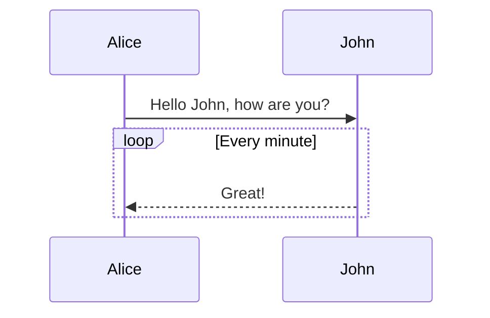
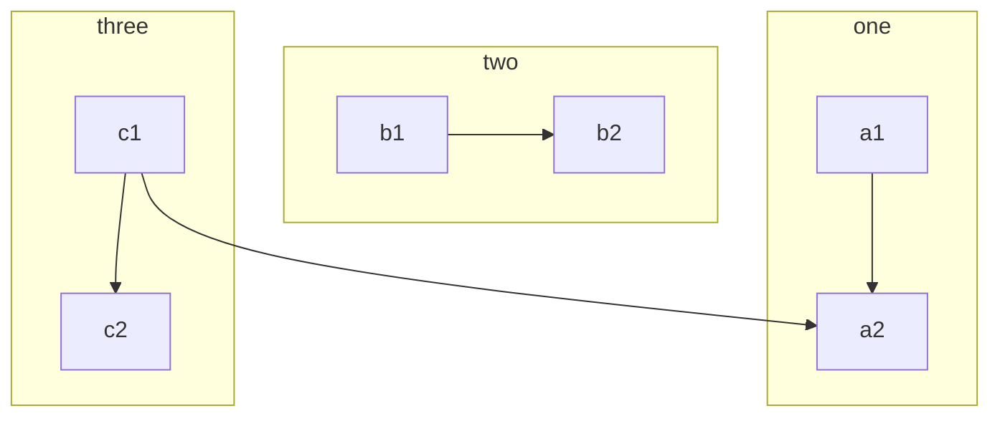
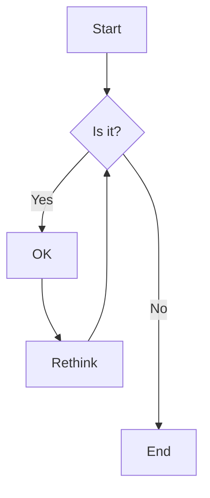
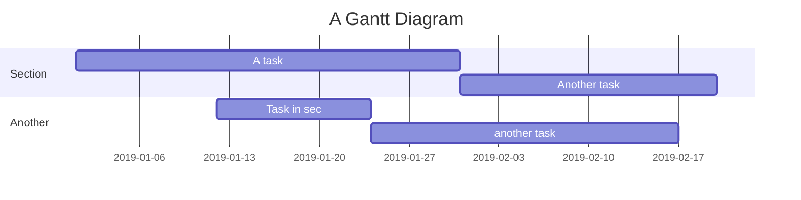
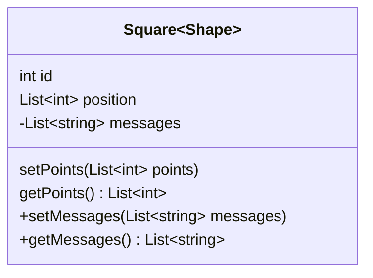
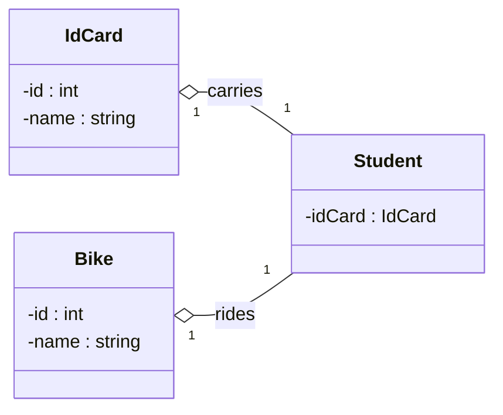
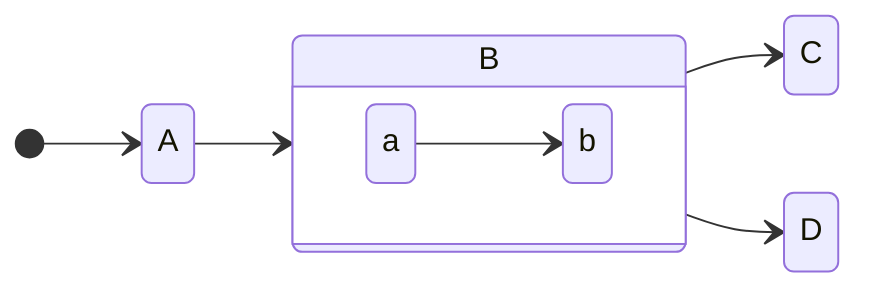
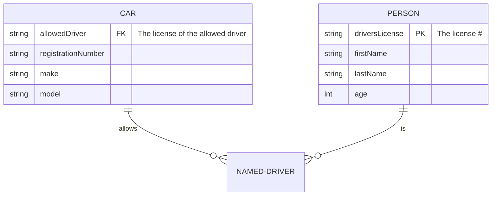

# 时序图



````md

````

# 流程图

## 使用graph标识



````md

````

## 使用flowchart标识


````md

````



````md

````

# 甘特图



````md

````

# Git树形图


````md

````

# 类图



````md

````



````md

````

# 状态图



````md

````

# 实体关系图



````md

````

# 旅程图

```mermaid
journey
    title My working day
    section Go to work
      Make tea: 5: Me
      Go upstairs: 3: Me
      Do work: 1: Me, Cat
    section Go home
      Go downstairs: 5: Me
      Sit down: 5: Me
```

````md
```mermaid
journey
    title My working day
    section Go to work
      Make tea: 5: Me
      Go upstairs: 3: Me
      Do work: 1: Me, Cat
    section Go home
      Go downstairs: 5: Me
      Sit down: 5: Me
```
````


# 饼图

```mermaid
pie
    title Key elements in Product X
    "Calcium" : 42.96
    "Potassium" : 50.05
    "Magnesium" : 10.01
    "Iron" :  5
```

````md
```mermaid
pie
    title Key elements in Product X
    "Calcium" : 42.96
    "Potassium" : 50.05
    "Magnesium" : 10.01
    "Iron" :  5
```
````

# 需求图

```mermaid
requirementDiagram

    requirement test_req {
    id: 1
    text: the test text.
    risk: high
    verifymethod: test
    }

    functionalRequirement test_req2 {
    id: 1.1
    text: the second test text.
    risk: low
    verifymethod: inspection
    }

    performanceRequirement test_req3 {
    id: 1.2
    text: the third test text.
    risk: medium
    verifymethod: demonstration
    }

    interfaceRequirement test_req4 {
    id: 1.2.1
    text: the fourth test text.
    risk: medium
    verifymethod: analysis
    }

    physicalRequirement test_req5 {
    id: 1.2.2
    text: the fifth test text.
    risk: medium
    verifymethod: analysis
    }

    designConstraint test_req6 {
    id: 1.2.3
    text: the sixth test text.
    risk: medium
    verifymethod: analysis
    }

    element test_entity {
    type: simulation
    }

    element test_entity2 {
    type: word doc
    docRef: reqs/test_entity
    }

    element test_entity3 {
    type: "test suite"
    docRef: github.com/all_the_tests
    }


    test_entity - satisfies -> test_req2
    test_req - traces -> test_req2
    test_req - contains -> test_req3
    test_req3 - contains -> test_req4
    test_req4 - derives -> test_req5
    test_req5 - refines -> test_req6
    test_entity3 - verifies -> test_req5
    test_req <- copies - test_entity2
```

````md
```mermaid
requirementDiagram

    requirement test_req {
    id: 1
    text: the test text.
    risk: high
    verifymethod: test
    }

    functionalRequirement test_req2 {
    id: 1.1
    text: the second test text.
    risk: low
    verifymethod: inspection
    }

    performanceRequirement test_req3 {
    id: 1.2
    text: the third test text.
    risk: medium
    verifymethod: demonstration
    }

    interfaceRequirement test_req4 {
    id: 1.2.1
    text: the fourth test text.
    risk: medium
    verifymethod: analysis
    }

    physicalRequirement test_req5 {
    id: 1.2.2
    text: the fifth test text.
    risk: medium
    verifymethod: analysis
    }

    designConstraint test_req6 {
    id: 1.2.3
    text: the sixth test text.
    risk: medium
    verifymethod: analysis
    }

    element test_entity {
    type: simulation
    }

    element test_entity2 {
    type: word doc
    docRef: reqs/test_entity
    }

    element test_entity3 {
    type: "test suite"
    docRef: github.com/all_the_tests
    }


    test_entity - satisfies -> test_req2
    test_req - traces -> test_req2
    test_req - contains -> test_req3
    test_req3 - contains -> test_req4
    test_req4 - derives -> test_req5
    test_req5 - refines -> test_req6
    test_entity3 - verifies -> test_req5
    test_req <- copies - test_entity2
```
````