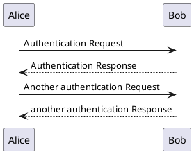

plantUML图


```plantuml
@startuml
Alice -> Bob: Authentication Request
Bob --> Alice: Authentication Response

Alice -> Bob: Another authentication Request
Alice <-- Bob: another authentication Response
@enduml
```

````md

```plantuml
@startuml
Alice -> Bob: Authentication Request
Bob --> Alice: Authentication Response

Alice -> Bob: Another authentication Request
Alice <-- Bob: another authentication Response
@enduml
```
````
